# Skew Notation: a synthesis of the Kinetic Alphabet guide sources

Written 2026-09-21 from Austen's Illustrator masters. This is the first
written account of the skew system that exists outside the drawings. Where a
claim is my reading rather than something the drawings state outright, it is
marked **(reading)**. Open questions are collected at the end.

## Sources

| File | Date | What it holds |
| --- | --- | --- |
| `D:\_THE KINETIC ALPHABET\_GUIDE\source\Skews.ai` | 2026-03-27 | Canonical. 25 artboards: single-grid skew pages, Tier 1 skewed frame, Level 5.1 to 5.3 covers, pentagrid and trigrid pages, atomics |
| `...\_STAGED_FOR_DELETION\Archive\Backup 4-11-23\THE KINETIC ALPHABET\GUIDE\Level 4 - Skews, Halves, Atomics.ai` (F: drive) | 2023-07-02 | Ancestor. 45 artboards. Same skew pages plus the Halves pages the 2026 file dropped |
| `...\_WORD_IMAGES (to import)\Original Flashcards\Original Flashcards\Level 4 Words (Skews).ai` | 2023-09-22 | Four-beat skew words in the 2023 halves notation |
| `...\MULTI-GRID\TRIGRIDS\Trigrids Skews.ai`, `...\PENTAGRIDS\Pentagrid Skews.ai` (F: drive archive) | 2022-12 | Early multi-grid pages, superseded by the 2026 file |
| `_LEGACY_DESKTOP_APP/docs/Education/levels/level-04-skewed-variations.md` | 2026-01-24 | Prose summary from the old desktop app. Agrees with the drawings |

The `.ai` files are PDF-compatible, so PyMuPDF renders every artboard as a
page. Rendered pages used here live in `docs/reference/skew-notation/`.

## 1. Vocabulary

- **Grid.** Eight points 45° apart. Cardinals (N E S W) are the diamond
  family, intercardinals (NE SE SW NW) are the box family.
- **Mode.** A beat is diamond when both hands sit on cardinals, box when both
  sit on intercardinals. The alphabet is identical in both modes.
- **Positions.** Alpha is hands opposite (180°). Beta is hands together (0°).
  Gamma is hands a quarter apart (90°). Two skewed positions join them:
  **zeta** is 135° apart, **eta** is 45° apart. Both are only reachable
  with one hand on each family.
- **Frame.** The pair of families the two hands occupy. Pure frames are
  diamond or box. A **skewed frame** has one hand on each family.
- **Shift.** A quarter turn (90°) around center. The base alphabet uses only
  0°, 90° and 180° motions (static, shift, dash).

## 2. The skew operator

A skew is a per-hand modifier applied to the **end** of a shift. The start
is never modified because the previous beat fixes it.

- **Plus** overshoots the endpoint by 45° along the hand's own rotation
  direction. The arc is 135°.
- **Minus** undershoots by 45°. The arc is 45°.
- Everything else is untouched: turn count, pro or anti, rotation direction,
  orientation math. The legacy doc says it plainly: same path around center,
  the hand just "overshot" or stopped short.
- Plus and minus are **relative to the hand's rotation**, not to clockwise.
  A clockwise hand's plus and a counterclockwise hand's plus point opposite
  ways on the grid.

Each hand independently takes one of three values, minus, zero, plus. That is
nine combinations per letter; the guide draws the eight that are not the base
letter across four pages.

| Page | Blue, red modifiers | From diamond alpha (A) lands in | Arcs |
| --- | --- | --- | --- |
| Plus | one hand +, other 0 | zeta (skewed frame) | 135° and 90° |
| Full Plus | + + | box alpha | 135° and 135° |
| Full Minus | − − | box alpha | 45° and 45° |
| Plus/Minus | + − or − + | box gamma | 135° and 45° |
| Minus (not drawn for the single grid) | one hand −, other 0 | zeta | 45° and 90° |

Two consequences the drawings make visible:

- **Full Plus and Full Minus are mode changes, not skewed frames.** Both hands
  land on the same family, so the next beat is an ordinary box beat.
- **Plus/Minus changes the position family.** Alpha becomes gamma because the
  hands' relative angle moved by 90°.

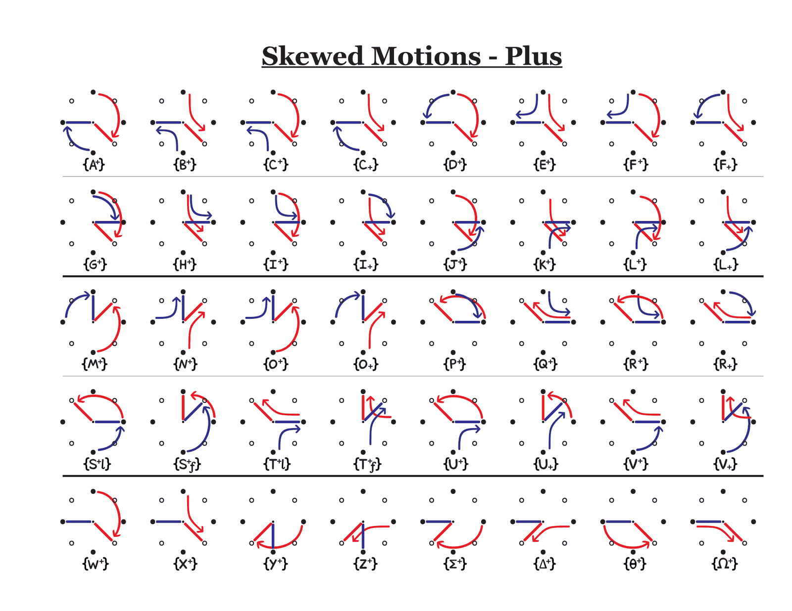
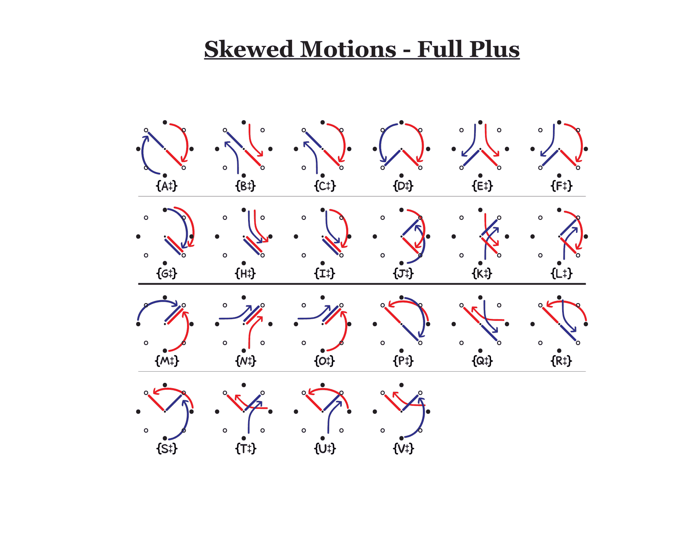
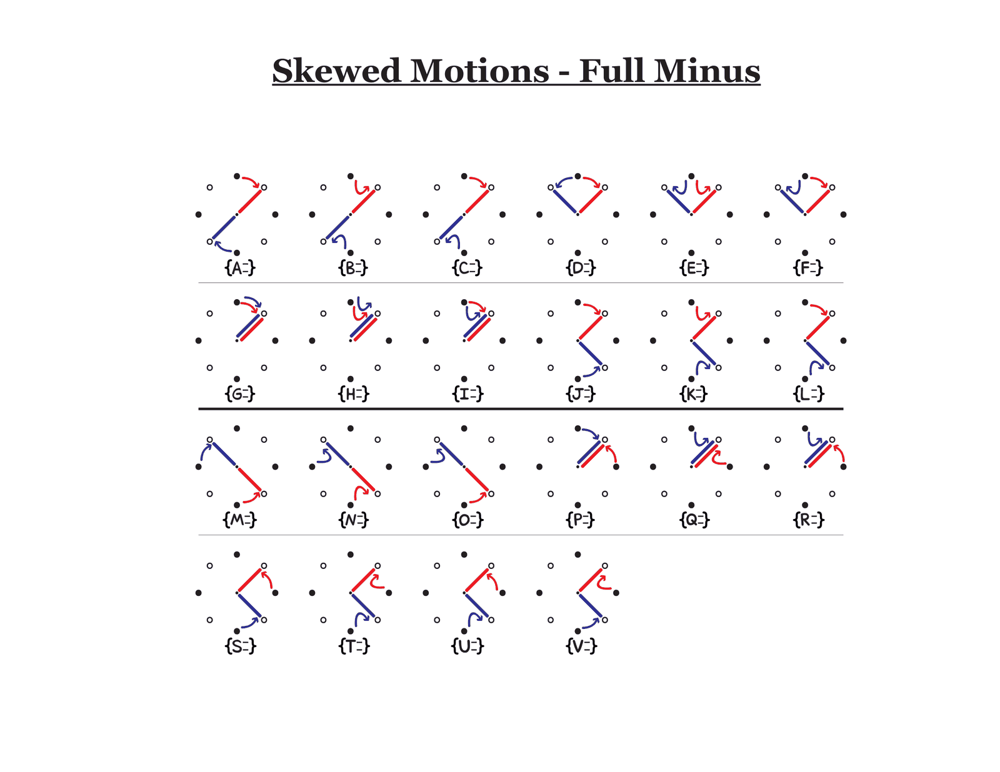
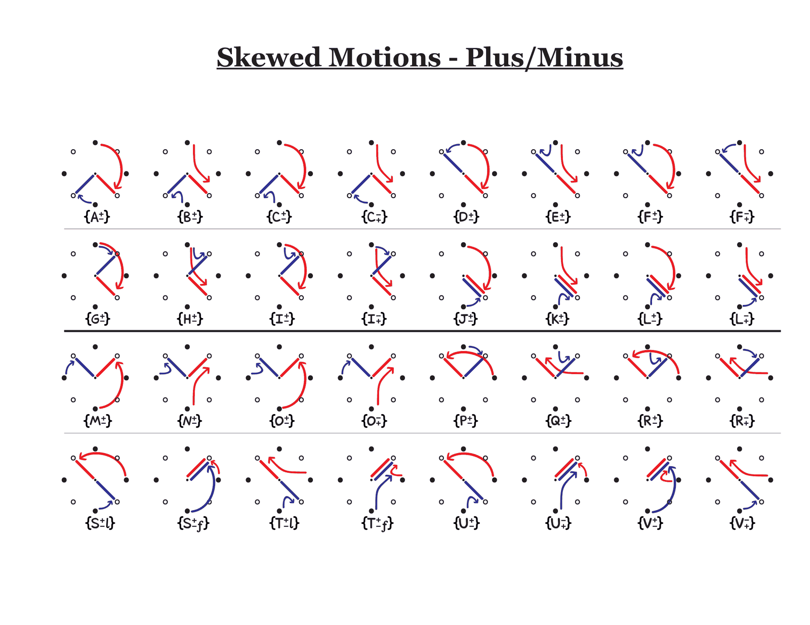

## 3. Notation

Level 5.1 assigns a bracket to each system: `{Skews}`, `[Halves]`,
`<Atomics>`.

- **Curly braces** mark a beat that involves the box and diamond families
  together, whether at the start, the end, or in the arcs.
- **Superscript plus** `{A⁺}`: one hand overshoots.
- **Double dagger** `{A‡}`: both hands plus. **Double minus** `{A⁼}`: both
  hands minus. **Plus-minus** `{A±}`: one of each.
- **Which hand takes the modifier**, for letters where the hands are
  distinguishable:
  - Pro/anti letters (C F I L O R U V): superscript modifies the pro hand,
    subscript modifies the anti hand. `{C⁺}` and `{C₊}` are different
    pictographs. **(reading, from the C cells: the smooth arc is the
    overshooting hand in one and the hooked arc in the other.)**
  - Lead/follow letters (S T): suffix `l` for the leading hand, `f` for the
    following hand. `{S⁺l}` skews the hand ahead in rotation.
  - Symmetric letters (A B D E G H J K M N P Q W X Y Z Σ Δ θ Ω): one variant,
    because skewing either hand gives the same pictograph up to color swap.
- Plus/Minus uses the same discriminators: `{C±}` versus `{C∓}`, `{S±l}`
  versus `{S∓f}`.

## 4. The skewed frame (Tier 1 Skewed Motions)

The page that matters most for the app. Every base letter is drawn performed
entirely inside a skewed frame: one hand on cardinals, one on intercardinals,
every arc an ordinary quarter turn, no modifiers. The label is the plain
letter in braces: `{A}`, `{M}`, `{W}`, `{Y}`.

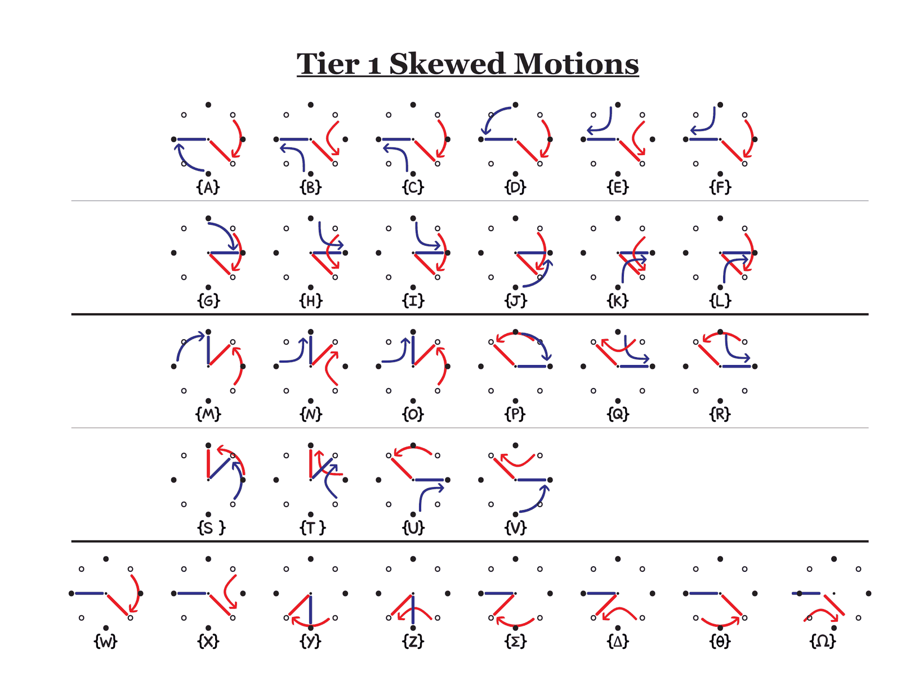

What the page establishes:

- **The letter survives skewing.** Offsetting one hand's frame by 45° does not
  change pro or anti, rotation direction, or the relationship between the
  hands, so the letter does not change.
- **Position families map across.** In the skewed frame, alpha letters run
  zeta to zeta, beta letters eta to eta, D E F run eta to zeta, J K L run
  zeta to eta, and gamma letters run between zeta and eta. Rows verified
  against the diamond dataframe's start and end placements.
- **Skewed frames can be sustained indefinitely.** A closed loop that never
  leaves the skewed frame is performable and drawable.

### The ambiguity in the frame

The ambiguity was resolved on 2026-09-21 by making the skewed letter a pure
function of the two hand motions, with no hidden state and no sequence
context.

### Type 1, same direction (both shift the same way): S T U V

Spacing is preserved, so the placement carries wide (zeta→zeta) vs narrow
(eta→eta). A B C G H I have no skewed form: their defining relation (hands
opposite or together) cannot hold in a mixed frame.

| Motions | Letter |
| --- | --- |
| pro + pro | S |
| anti + anti | T |
| pro leads | U |
| anti leads | V |

Leader: the hand that is ahead in the direction of travel by the smaller arc.
Verified against `DiamondPictographDataframe.csv`: every U row's leader is its
pro hand, every V row's leader is its anti hand.

### Type 1, opposite direction: D E F, J K L, M N O, P Q R

Opposite shifts flip the spacing (eta↔zeta) and pass through exactly one pure
position on the way: converging hands meet (cross beta), diverging hands pass
through opposite (cross alpha). Start spacing plus the crossed position picks
the family; pro/anti picks the member (pro/pro, anti/anti, hybrid).

| Start | Crosses | Family |
| --- | --- | --- |
| eta | alpha | D E F |
| eta | beta | P Q R |
| zeta | beta | J K L |
| zeta | alpha | M N O |

Verified against the diamond CSV: every M row crosses alpha, every P row
crosses beta (the same rule applied to gamma starts).

### Type 2 (shift + static) by start→end spacing

| Start→End | pro | anti |
| --- | --- | --- |
| zeta→zeta | W | X |
| eta→eta | Y | Z |
| zeta→eta | Σ | Δ |
| eta→zeta | Θ | Ω |

### Type 3 (shift + dash)

A Type 3 letter is the Type 2 pictograph with a dash arrow on the formerly
static hand. In the standard alphabet that makes `W-` share its pictograph
with Y (gamma→beta plus a dash lands at alpha, which is W's end), and `Σ-`
with Θ. The skewed table applies the same relation:

| Start→End | pro | anti |
| --- | --- | --- |
| eta→zeta | W- | X- |
| zeta→eta | Y- | Z- |
| eta→eta | Σ- | Δ- |
| zeta→zeta | Θ- | Ω- |

### Type 4 (dash + static)

Eta behaves as beta, zeta as alpha. eta→zeta (opening) = Φ, zeta→eta
(closing) = Ψ. No Λ (gamma→gamma has no skewed analogue).

### Type 5 (dual dash)

zeta→zeta = Φ-, eta→eta = Ψ-. No Λ-.

### Type 6 (both static)

ζ at zeta, η at eta. Both already exist in the `Letter` enum with glyphs.

### Count

4 + 12 + 8 + 8 + 2 + 2 + 2 = 38. Every combination of
{pro cw, pro ccw, anti cw, anti ccw, static, dash} per hand over the 32 mixed
start pairs is a valid skewed-frame beat: 32 × 36 = 1152 beats, all lettered.

The classifier is `src/lib/shared/pictograph/skew/skewed-frame-letter.ts`; the
dataframe rows are category 3 in `SkewedPictographDataframe.csv`.

## 5. The neighbours: Halves, Atomics, Staggers

The same guide bundles three other systems. None is needed for skew
lettering, but they share vocabulary and the 2023 flashcards mix them.

**Halves** `[XY]`. A beat split into two half-beat letters. `[AS]` is A in the
first half and S in the second. Pages are organised by the letter types of the
two halves (Type 1 to 1, 1 to 2, 3 to 3, 3 to 1, and so on) and by what changes
at the midpoint: Continuous, Hand-Reversal, Prop-Reversal, Full-Reversal. A
tick mark on an arc shows where a full-beat shift crosses the midpoint. A
"half-shift" is a 45° arc that is one half of a shift. **(reading)** The
midpoint timing is the part I am least sure of.

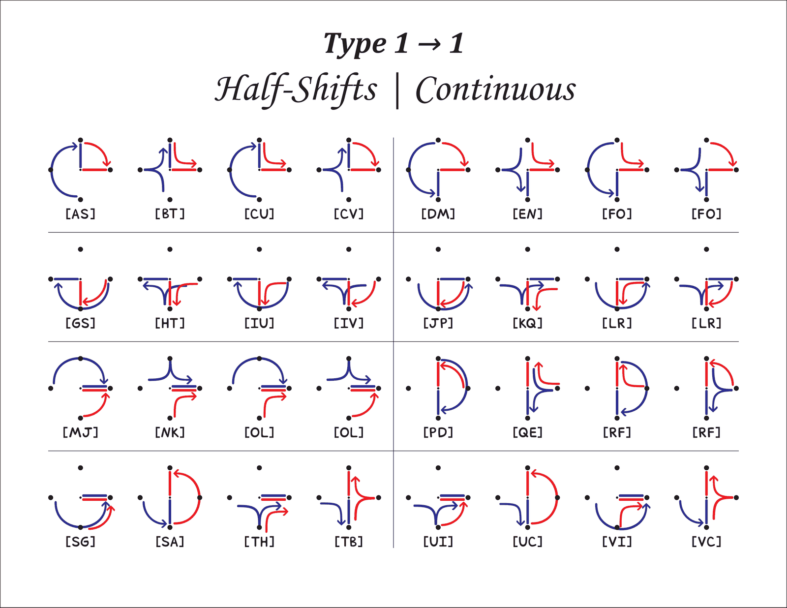
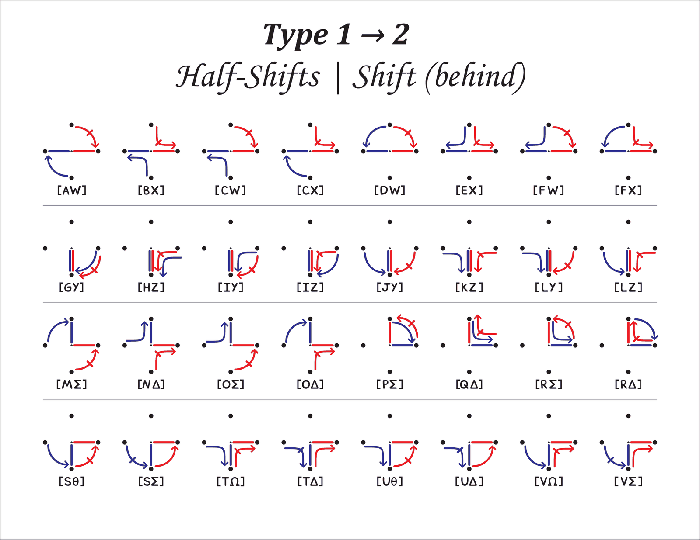
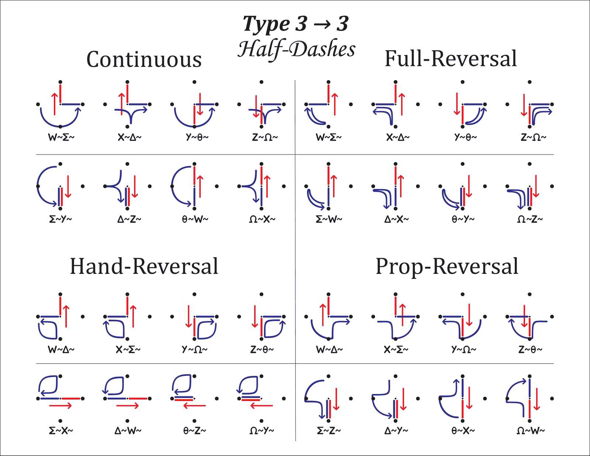

**The 2023 flashcard notation for skews** wrote skew entry and exit as halves.
`Z-[¹]` is Z- with the red hand doing the first half of its shift (45°,
landing on the box family). `R[₁]` is R with the red hand doing the second
half (45°, landing back on the diamond family). The coloured digit names the
hand, superscript the first half, subscript the second. The words on that
sheet are four beats each: `Z-[¹] R[₁] Z- F`, `Ω-[¹] F[₁] Ω- O`, `X-[¹] O[₁] X- L`,
`Δ-[¹] L[₁] Δ- R`. The 2026 braces and signs replace this for skews.
**(reading)** The later sheet also shows `Δ̇-[¹]₁` with a dot over the letter
and a black subscript outside the bracket; I could not decode either mark.

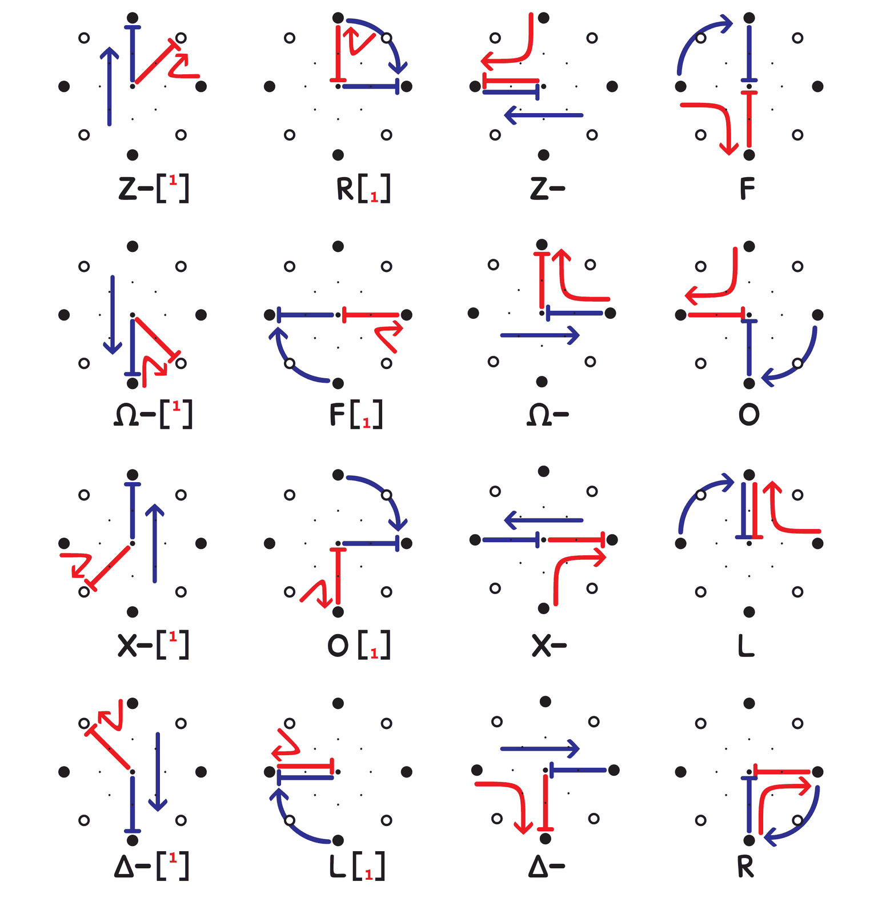

**Atomics** `<M>`. A letter's hand motions drawn from three viewpoints, behind,
above, and right. This is the wall-plane and floor-plane material already in
the repo, not a skew concept.

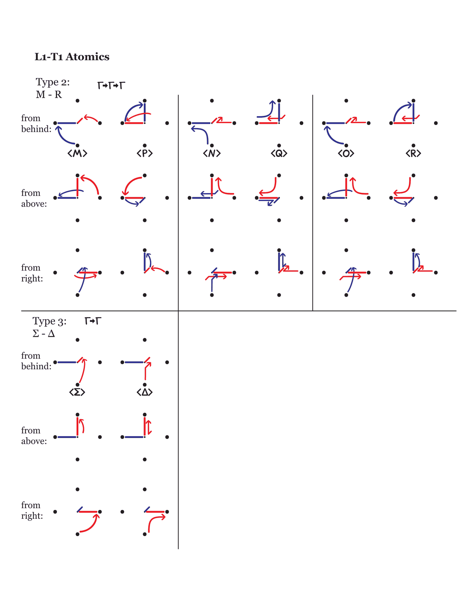

**Staggers.** Named on the Part 4 cover ("Skews, Atomics, Staggers, guide
coming soon") and not drawn anywhere I found.

## 6. Multi-grid

The operators generalise. On the **pentagrid** (two pentagons offset by 36°,
ten points) a plus is one 36° step past the endpoint and "double plus" is two,
which lands back on the starting pentagon. Because a pentagon has no antipode,
letters that depend on "opposite" split into variants: `{C1}` `{C2}`, `{M1}`
`{M2}`, `{N1}` `{N2}`, `{O1}` `{O2}`. Some cells carry an `ˣ` or `ₓ` mark I
could not decode. The **trigrid** (three points, 120°) has no alpha at all, so
its Tier 1 page runs G through Z plus β and Γ.

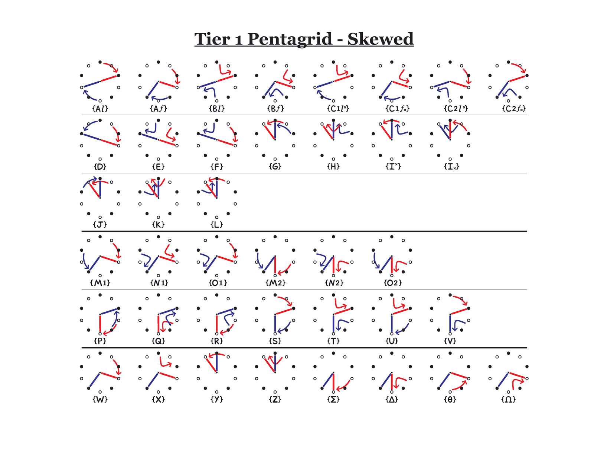
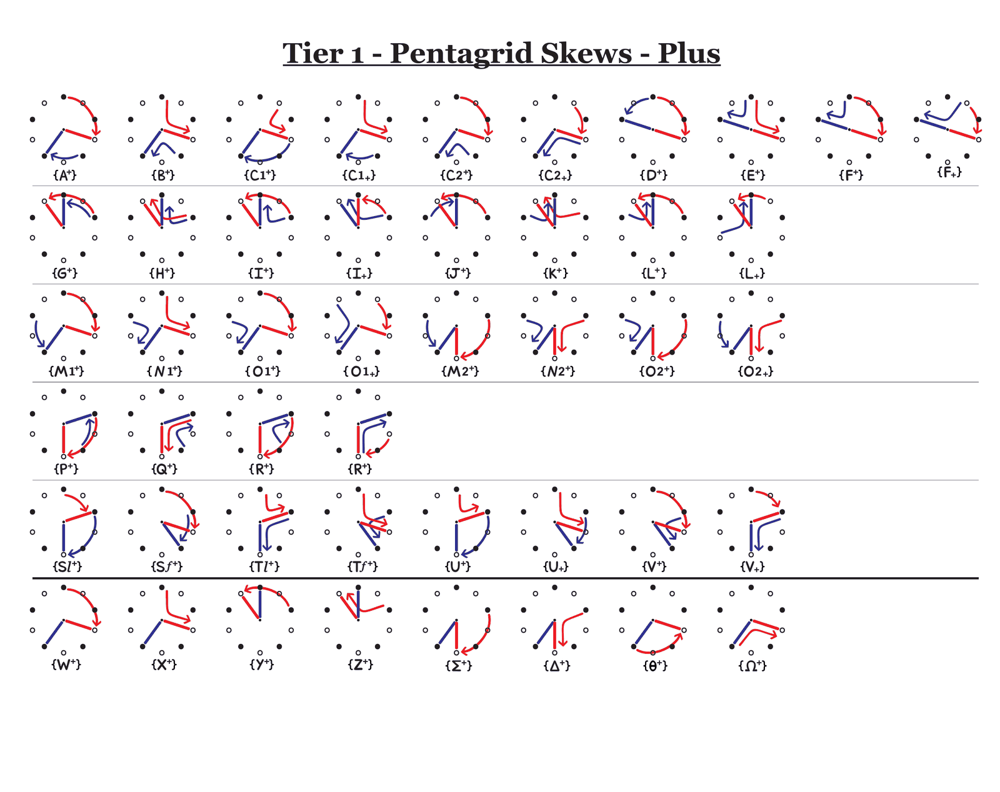
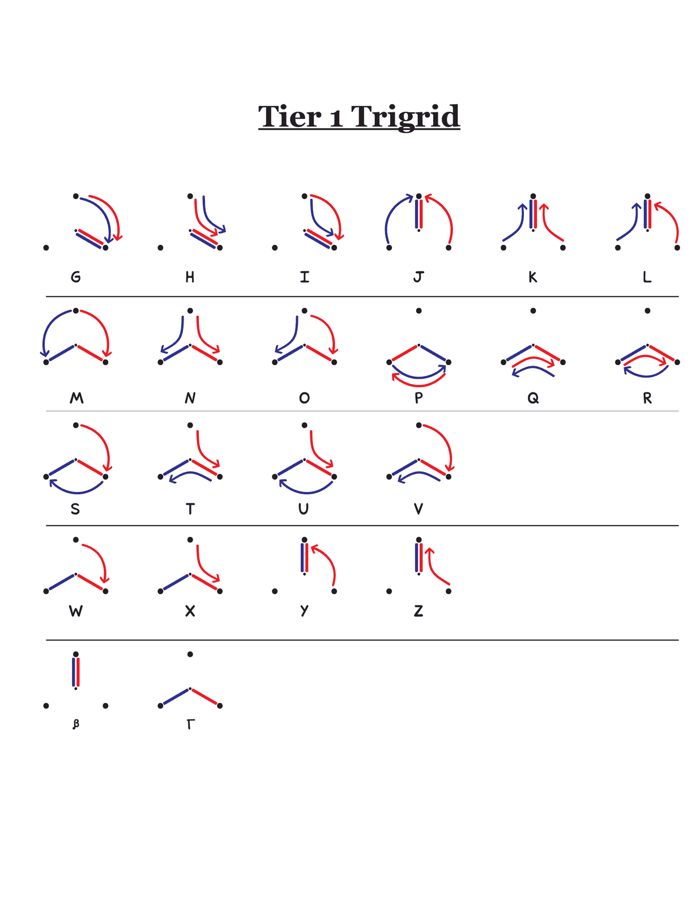

## 7. State of the repo before the 2026-09-21 change

This section describes the repository as it stood before the change and is
kept as the historical baseline. Sections 4 and 8 describe the shipped state,
where the CSV has 6,272 rows, 1,152 of them category 3 rows that start from
zeta or eta, and every skew-to-skew beat is lettered by the classifier in
`src/lib/shared/pictograph/skew/skewed-frame-letter.ts`.

Verified against the repo on 2026-09-21.

- `static/data/pictographs/SkewedPictographDataframe.csv` had 5,120 rows with
  per-hand `SkewDir` (+, −, blank), `SkewSteps` (0 or 1) and `HandPath`. All
  eight sign combinations are present. This is the guide's modifier system,
  one row per pictograph.
- Every row starts from alpha, beta or gamma. End placements are zeta (1,536),
  eta (1,536), gamma (1,024), alpha (512), beta (512). Category 1 ends
  skewed, category 2 is a mode change (Full Plus, Full Minus, Plus/Minus).
- **No row started from zeta or eta.** The Tier 1 Skewed page, skew to skew,
  had zero coverage. So did leaving a skewed frame.
  `scripts/generate-skewed-dataframe.ts` built the file by applying skew to
  diamond and box rows, which is why.
- Placements are numbered: alpha1 to 8, beta1 to 8, gamma1 to 16, zeta1 to 16,
  eta1 to 16.
- `deriveGridMode` in `src/lib/shared/pictograph/grid/services/grid-mode-deriver.ts`
  returns SKEWED when either motion crosses families or the two hands sit on
  different families. Correct, and it matches the braces rule.
- `MotionQueryHandler` searches the skewed dataframe for SKEWED beats and
  falls back to the diamond rows only when the skewed file is empty. A
  skew-to-skew beat therefore matched nothing and got no letter.
- The fuse rule (`src/lib/features/fuse/domain/fuse-rule.ts`) stores the
  follower's rotation as clockwise 45° steps, 0 to 7. Odd steps put the
  follower on the other family for the whole path. That is a known, uniform
  offset for every beat, which was the state section 4 described at the
  time.
- `buildFusedSequence` in `src/lib/features/fuse/state/fuse-state.svelte.ts`
  treats any unlettered step as fatal ("Couldn't identify every fused step")
  and the word and display name are built from letters. Nothing downstream in
  the save path has been checked yet for tolerance of a null letter.

## 8. What this implies for lettering skewed beats

What shipped:

- The classifier is the source of truth for skewed-frame letters. The
  generator enumerates every frame-start beat and writes it as a category 3
  row, so the runtime lookup and the option picker need no special casing.
- Braces mark the skewed span in the stored word (`A{STS}GA`; consecutive
  skewed beats share one pair; the entry and exit beats are inside the span;
  step letters stay plain). The word is built by `deriveWordFromBeats`, the
  `stepPairings` branch of `deriveWord`, `deriveWordStatusFromSteps`, and
  `deriveWordStatusFromStepPairings`, all in
  `src/lib/shared/foundation/services/word-deriver.ts`.
- Sites that index, sort, or search words strip the braces with
  `stripWordNotation` (`src/lib/shared/foundation/utils/word-notation.ts`).
- The pictograph draws braces around the letter of a skewed-frame beat
  (`SkewBraces.svelte`); the choreo-card word glyph draws one pair around the
  row when the whole word is one span.
- Out of scope:
  - Exit-beat letters for skewed→pure arcs of 45°/135° (the frame's own
    category-1 rows already cover pure→skewed entry).
  - Hand swaps inside a span, modifiers (⁺ ⁻ ‡ ± l f) in the word, a `$`
    sigil.
  - Brace glyphs on the canvas card header and partial-span braces in
    `TKAWordGlyph`.
  - Generator Level 4 (SKEWED) in the create tab.

## 9. Decisions (2026-09-21)

- S T U V are the only same-direction letters; A B C G H I have no skewed
  form.
- D E F / J K L / M N O / P Q R are chosen by start spacing plus the crossed
  pure position: a converging pair crosses beta, a diverging pair crosses
  alpha.
- Type 2 is chosen by the start-to-end spacing pair: W X are zeta to zeta,
  Y Z are eta to eta, Σ Δ are zeta to eta, Θ Ω are eta to zeta.
- Type 3 is the Type 2 partner with the dash flipping the end spacing.
- Φ and Ψ are used only for Type 4 and Type 5; there is no Λ.
- ζ and η are Type 6.
- Braces go in the stored word.
- There is no `$` sigil.
- Modifiers (plus, minus, double-dagger, plus-minus, l, f) are deferred to a
  later round.

## Appendix: artboard index for Skews.ai (2026)

| Page | Content |
| --- | --- |
| 1 | Cover |
| 2 | Part 4 title: Skews, Atomics, Staggers |
| 3 | Skewed Motions, Plus |
| 4 | Stray 14x9 pt artboard, empty |
| 5 | Skewed Motions, Full Plus |
| 6 | Skewed Motions, Full Minus |
| 7 | Skewed Motions, Plus/Minus |
| 8 | Tier 1 Skewed Motions |
| 9, 10 | L1-T1 Atomics, three views (M to R and Σ Δ; A to L) |
| 11 to 17 | Tier 1 Pentagrid Skews: Double Plus, Minus, Plus/Minus, Double Plus/Minus, Skewed, Plus, Full Plus |
| 18 | Level 5.1 cover: {Skews} [Halves] <Atomics> |
| 19 | Level 5.2 cover: Atomics |
| 20 | Level 5.3 cover: Tri-grid, Penta-grid |
| 21 | Tier 1 Trigrid |
| 22 | Tier 1 Pentagrid |
| 23 to 25 | Stray tiny artboards |

The 2023 Level 4 file adds pages 23 to 37: Half-Shifts and Half-Dashes by type
transition and reversal kind, a note that Type 4 and 5 halves need centric
letters, a "need examples from a skewed position" reminder, and a pentagrid
placement list (true alpha, penta-alpha, penta-zeta, penta-gamma, penta-eta,
beta).
